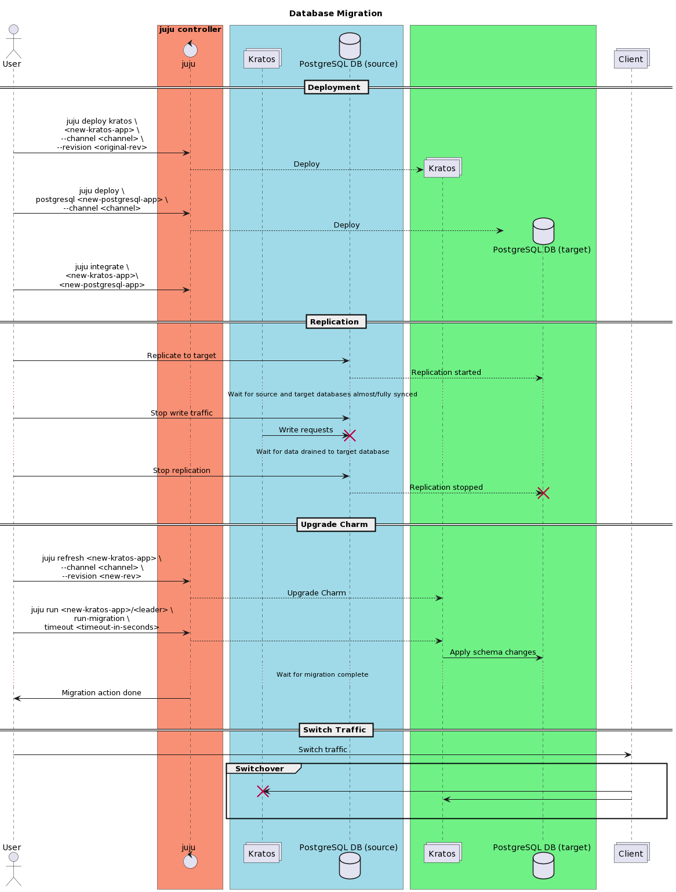

# Database Migration

## Overview

Migrating database is a daunting but inevitable task when using the Kratos Charm
because Ory Kratos introduces SQL migrations in new releases. This documentation
aims to help the Charm end users by providing some clues on migration
strategies.

## Some Facts and Friendly Reminders

- The Charm release versions stick to the Ory Kratos versions. This means each
  Charm release will probably require end users to do migration. End users
  should refer to
  the [Ory Kratos CHANGELOG](https://github.com/ory/kratos/blob/master/CHANGELOG.md)
  to check if migration is needed before upgrading the Charm.
- The Ory Kratos maintains
  the [sql migrations](https://github.com/ory/kratos/blob/master/persistence/sql/README.md)
  in the codebase. End users can find the DDL statements
  in [this directory](https://github.com/ory/kratos/tree/master/persistence/sql/migrations/sql).
- Ory Kratos
  provides [CLI](https://www.ory.sh/docs/kratos/cli/kratos-migrate-sql) to
  migrate database. But it does not provide further guidelines for migrating
  database in a production environment, not to mention in a large-scale
  distributed system.
- Follow the suggested strategies in this documentation at your discretion.
- There is no silver bullet when coming to database migration. If end user's
  case does not fit in any strategies in this doc, either develop and maintain a
  strategy or reach out to Ory team for further advices
  via [chat](https://slack.ory.sh/)
  or [discussions](https://github.com/ory/kratos/discussions).

## Migration Strategies

We provide guidelines for database migration when upgrading the Kratos Charm.
The end users can follow, adapt, or be inspired from the following strategies.

### Naive Strategy (in-place migration)

:rotating_light: **CAUTION: this method changes the database schemas in-place.
Please use it with discretion.**

```shell
# 1. Upgrade the Charm
$ juju refresh <kratos-app> --channel <channel> --revision <revision>

# 2. Trigger the migration action
$ juju run <kratos-app>/<leader> run-migration timeout=<timeout in seconds>

# 3. Check the action status
$ juju show-task <task-id>
```

### Common Strategy

The common migration strategy falls into concepts of redundancy (e.g. blue/green
deployments) and traffic switchover. The following diagram illustrates the
process.



1. Prepare and deploy a new Kratos Charm with **SAME VERSION** and a PostgreSQL
   Charm. Integrate the two Charms.

```shell
$ juju deploy kratos <new-kratos-app> --channel <channel> --revision <original-rev>
$ juju deploy postgresql <new-postgresql-app> --channel <channel>
$ juju integrate <new-kratos-app> <new-postgresql-app>
```

2. Use database migration systems or database replication mechanisms to sync
   source database to target database. Wait for the target database is
   almost/fully synchronized with the source database.
3. Stop writing traffic to the source database. Wait for all remaining data to
   drain to the target database. The source and target databases are now fully
   synchronized.
4. Upgrade the new Kratos Charm.

```shell
$ juju refresh <new-kratos-app> --channel <channel> --revision <new-rev>
```

5. Trigger the migration action. **Note: depending on the data size, you may
   want to use a large timeout threshold.**

```shell
$ juju run <new-kratos-app>/<leader> run-migration timeout=<timeout-in-seconds>
```

6. Once migration is completed, switch over the traffic to the new Kratos Charm.

:rotating_light: **Note:**

- Migration strategies can vary significantly in different use cases due to
  SLA/SLOs, migration downtime tolerances, overall deployment architectures,
  traffic volumes and patterns, etc. End users may want to develop and
  maintain a migration strategy tailored for their use cases.
- The end users can select the most convenient migration systems/tools for
  them to use.
- In terms of replications between two PostgreSQL Charms, guidelines will be
  provided in the future.

## Other Scenarios

Although this doc covers the migration scenario when upgrading Charm, there
might be other scenarios in which end users may need to do migration.

### Update Identity Schema

End users may want to initiate an update
for
an [identity schema](https://www.ory.sh/docs/kratos/manage-identities/identity-schema)
used in the Charm. In this case, please refer to
the [best practice](https://www.ory.sh/docs/kratos/manage-identities/best-practices#updating-identity-schemas)
to plan the migration.

## Good Practices

There are some good practices to adopt when dealing with database migrations.

- Work with DBA or other database professionals if available to find a most
  fitting migration solution for your own case.
- Inspect and understand the system traffic patterns. In general, web
  application live traffic shows a tidal pattern. Plan ahead and perform the
  migration plans during the traffic low peak time.
- Prepare a fallback/rollback strategy when migration plan fails.
- Prepare a testing/staging environment which resembles the production
  environment to simulate the migration and fallback/rollback strategies before
  moving forward to production.
- Perform database backups at the critical points of migration plan, e.g. before
  migration starts, after draining the source database, etc.
- Perform database backups using the replicas instead of primary. If possible,
  add a new replica specifically responsible for backup job.
- Perform database completeness and consistency validations after the migration.
- If possible, apply professional database migration systems/tools for the
  migration.
- If possible, try best to follow
  the [database per service pattern](https://microservices.io/patterns/data/database-per-service.html)
  to deploy Kratos and PostgreSQL Charms.

## References

- [`kratos migrate sql` documentation](https://www.ory.sh/docs/kratos/cli/kratos-migrate-sql)
- [Backup the PostgreSQL Charm](https://charmhub.io/postgresql/docs/h-create-and-list-backups)
- [Database migration: Concept and Principles](https://cloud.google.com/architecture/database-migration-concepts-principles-part-1)
